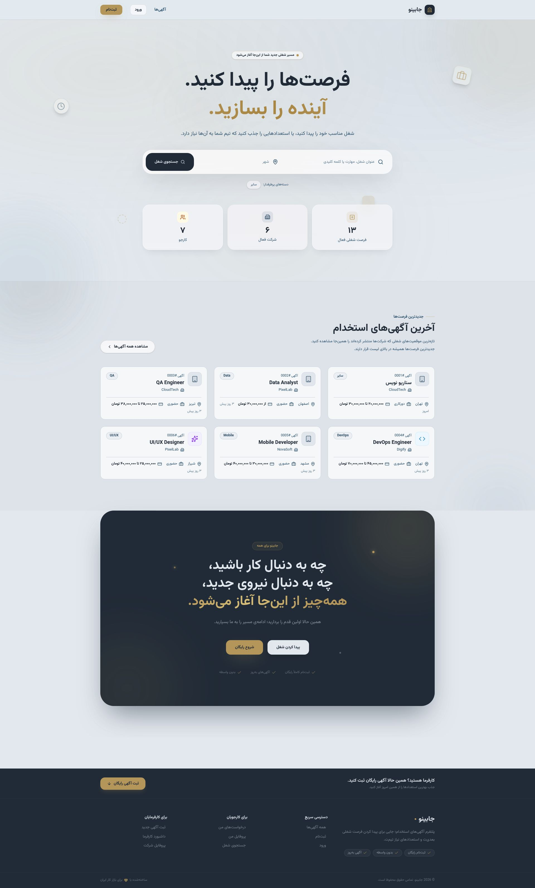

# Jobino — Job Board Platform

A full-stack job board platform built with Next.js, TypeScript, Prisma, Better Auth, and PostgreSQL.

🔗 **Live Demo:** [jobboard-6p9y.vercel.app](https://jobboard-6p9y.vercel.app)

---

Jobino is a full-stack job board application designed around realistic hiring workflows between **job seekers** and **employers**. The project focuses not only on UI implementation, but also on authentication, authorization, database relationships, validation, file uploads, search, testing, accessibility, and reliable end-to-end workflows.



## 📚 Table of Contents

- [Features](#-features)
- [Tech Stack](#-tech-stack)
- [Architecture](#️-architecture)
- [Main User Flows](#-main-user-flows)
- [Database](#️-database)
- [Resume Upload](#-resume-upload)
- [Accessibility](#-accessibility)
- [SEO](#-seo)
- [Testing](#-testing)
- [Getting Started](#-getting-started)
- [Code Quality](#-code-quality)
- [Project Goals](#-project-goals)
- [Future Improvements](#-future-improvements)
- [Author](#-author)

---

## ✨ Features

### 👤 Authentication & Roles

- User registration and authentication
- Separate **Candidate** and **Employer** roles
- Role-based access control
- Protected dashboard routes
- Session-based authentication with Better Auth
- Ownership checks for employer resources

### 💼 Job Management

**Employers can:**
- Create job listings
- Edit existing jobs
- Manage published jobs
- View applicants
- Review candidate applications
- Update application statuses

**Candidates can:**
- Browse available jobs
- Search and filter jobs
- View detailed job information
- Apply to jobs
- Withdraw applications
- Save jobs for later
- Track application status

### 📄 Applications & Resumes

- Cover letter support
- Application status workflow
- Resume upload support
- PDF resume validation
- Secure file URL handling
- Candidate application history

Application status workflow:

```
PENDING → REVIEWED → ACCEPTED
```

Candidates can also withdraw an application when the current status allows it.

### 🔎 Search & Filtering

Job search supports:

- Keyword search
- Location filtering
- Remote-work filtering
- Salary filtering
- Pagination
- Persian text normalization

The search implementation handles Persian text variations such as نیم‌فاصله, regular spaces, and ZWNJ variants — making search more reliable for Persian job titles and descriptions.

### 🛡️ Validation & Security

- Zod schema validation
- Role-based authorization
- Resource ownership checks
- HTTP/HTTPS URL validation
- Protection against unsafe URL schemes
- Safe JSON-LD generation
- Database uniqueness constraints
- Handling Prisma unique-constraint conflicts
- Protected E2E cleanup endpoint
- Rate-limit control for sensitive auth routes

### ♿ Accessibility

- Semantic HTML
- Accessible form labels
- Keyboard navigation
- Focus states
- Error, loading, and empty states handled explicitly

### 🔍 SEO

- Dynamic metadata
- Sitemap and robots configuration
- JSON-LD structured data for job pages, generated safely to avoid unsafe content injection

---

## 🧰 Tech Stack

| Layer | Technologies |
|---|---|
| **Frontend** | Next.js 16 · React 19 · TypeScript · Tailwind CSS · Lucide React · Vazirmatn (Persian font) |
| **Backend** | Next.js Server Actions · Prisma ORM · PostgreSQL · Better Auth · Zod |
| **Storage** | Vercel Blob (resume uploads) |
| **Testing** | Vitest (unit) · Playwright (E2E) |
| **Code Quality** | ESLint · TypeScript · Husky · lint-staged |

---

## 🏗️ Architecture

The project follows a feature-oriented Next.js application structure:

```
jobboard/
├── e2e/
│   ├── fixtures/
│   ├── global-teardown.ts
│   └── jobboard.spec.ts
│
├── prisma/
│   └── schema.prisma
│
├── public/
│
├── src/
│   ├── app/
│   │   ├── api/
│   │   ├── candidate/
│   │   ├── employer/
│   │   ├── jobs/
│   │   └── ...
│   │
│   ├── components/
│   ├── lib/
│   └── ...
│
├── middleware.ts
├── next.config.ts
├── playwright.config.ts
├── prisma.config.ts
├── vitest.config.ts
└── package.json
```

---

## 🔄 Main User Flows

**Candidate flow**
```
Register → Candidate Dashboard → Browse Jobs → Search / Filter
  → View Job → Apply → Track Application → Accepted / Rejected / Withdrawn
```

**Employer flow**
```
Register → Employer Dashboard → Create Job → Manage Jobs
  → View Applicants → Review Application → Update Status
```

---

## 🗄️ Database

Prisma is used as the ORM for database access and relational data management. Core entities include Users, Sessions, Jobs, Applications, Saved Jobs, candidate profiles, and company profiles.

Database-level constraints are used alongside application-level validation to maintain data integrity — for example, duplicate applications are prevented both through validation logic and a database uniqueness constraint.

---

## 📁 Resume Upload

Resume uploads are handled through **Vercel Blob**:

1. File type validation (PDF only)
2. File size validation (max 5 MB)
3. Upload to Blob storage
4. Secure URL handling
5. Association with the candidate's application

The E2E suite also covers resume uploads when the required Blob environment variable is available.

---

## 🧪 Testing

### Unit Tests — Vitest
Covers pure application logic: salary formatting, relative date formatting, Persian search normalization, filter parsing, salary range matching, and validation schemas for jobs, applications, and application status.

Current unit-test coverage: **62 tests**.

```bash
npm run test:unit
```

### End-to-End Tests — Playwright
Simulates a full hiring workflow:

```
Register Employer → Register Candidate → Create Jobs → Apply to Jobs
  → Save / Withdraw → Review Application → Accept Application
  → Verify Candidate Status
```

The E2E environment includes automatic cleanup of test records.

```bash
npm run test:e2e
```

### Lint & Type Check

```bash
npm run lint
npx tsc --noEmit
```

> Make sure the local database and required environment variables are configured before running the E2E suite.

---

## 🚀 Getting Started

### 1. Clone the repository
```bash
git clone https://github.com/mina-gharzi/jobboard.git
cd jobboard
```

### 2. Install dependencies
```bash
npm install
```

### 3. Configure environment variables
Copy `.env.example` to `.env` and fill in the values:

```bash
cp .env.example .env
```

| Variable | Description |
|---|---|
| `DATABASE_URL` | PostgreSQL connection string |
| `BETTER_AUTH_SECRET` | Secret used to sign auth sessions |
| `NEXT_PUBLIC_APP_URL` | Public base URL of the app (e.g. `http://localhost:3000`) |
| `BLOB_READ_WRITE_TOKEN` | Vercel Blob token for resume uploads |

### 4. Prepare the database
```bash
npx prisma generate
npx prisma migrate dev
```

### 5. Start the development server
```bash
npm run dev
```

Open [http://localhost:3000](http://localhost:3000).

---

## 🧹 Code Quality

The project uses ESLint for static analysis, TypeScript for type safety, Husky for Git hooks, and lint-staged to check staged files before every commit — keeping the codebase consistent and catching issues early.

---

## 🎯 Project Goals

Jobino was built as a portfolio-grade full-stack application with emphasis on:

- Real-world user flows
- Type-safe development
- Secure authentication
- Database integrity
- Server-side validation
- Practical testing
- Accessibility & SEO
- Maintainable architecture
- Production-oriented UX

Rather than focusing only on visual implementation, the project demonstrates how a complete web application can be designed across the **frontend, backend, database, authentication, validation, and testing layers**.

---

## 📌 Future Improvements

- Expanded automated coverage for server actions
- More comprehensive file-upload test coverage
- Additional performance optimizations
- CI-based automated test execution
- Further production monitoring and observability

---

## 👩‍💻 Author

**Mina Gharzi** — Frontend Developer
[GitHub](https://github.com/mina-gharzi)

## 📄 License

This project is licensed under the [MIT License](./LICENSE).